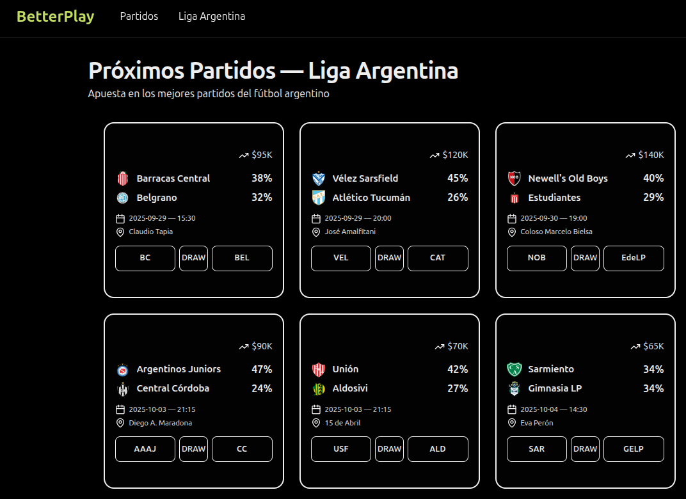

# ⚽ BetterPlay — On‑Chain Betting for Liga Argentina

<p align="center">
  
</p>

<p align="center">
  <strong>BetterPlay</strong> is a decentralized, non‑custodial betting app for <strong>Liga Argentina</strong> matches. Users stake <strong>USDC</strong> on match outcomes (Local / Draw / Visitante) on <strong>Polygon</strong> (Amoy testnet or Mainnet), with transparent pools and on‑chain settlement.
</p>

---

## 🔍 What It Does

**BetterPlay** lets you:
- Browse upcoming matches from the **Argentine league**.
- Pick an outcome: **Local**, **Empate**, or **Visitante**.
- Stake **USDC** with one click (auto‑approval flow when needed).
- Get a live **payout preview** based on current pool balances.
- **Claim** winnings on‑chain after the market is resolved.

**Embedded-ready:** it works standalone in the browser **and** embedded in the **Beexo** mobile app via an EIP‑1193 provider (XO Connect). No extra connect button required in embedded mode.

---

## 🧪 How It Works

1. **Markets (3‑way outcomes)**  
   Each match is a market with three outcomes: Local (home win), Empate (draw), Visitante (away win). The smart contract tracks **pools** per outcome.

2. **Odds & Payout Preview**  
   The UI shows:
   - A quick implied probability from the displayed odds (for UX familiarity).
   - **On‑chain payout preview** via `previewPayoutPer1(marketId, outcome)` from `BetterPlay.sol`, used to estimate your potential return for 1 USDC (scaled by `1e18`).

3. **Stake & Approval**  
   The app checks your **USDC allowance**. If it’s insufficient, it triggers an **approve** call before placing the **bet**. Both flows are visible in the UI with toasts.

4. **Resolution & Claim**  
   After the result is set on‑chain (admin/oracle finalizes the winning outcome), winners call **`claim(marketId)`** to withdraw their proceeds.

5. **Dual connectivity (Normal / Embedded)**  
   - **Normal** (web): uses **wagmi + viem** with your wallet extension or WalletConnect.  
   - **Embedded** (Beexo): uses **XOConnectProvider** (EIP‑1193) and routes **reads & writes** through the embedded provider for a seamless in‑app experience.

---

## 🔒 Why It Matters

- **Transparent**: odds emerge from **pool balances**; payouts are computed by the contract.
- **Trust‑minimized**: funds move via **USDC** and **Polygon**; no custodial balances.
- **Mobile‑first**: embedded flow for **Beexo**—no popups or extensions needed.
- **Composability**: built with **viem**/**wagmi**; easy to extend to new leagues/markets.

---

## 📊 UI Primitives & Flows

- **Matches Grid** (`src/components/matches-grid.tsx`)  
  Shows games, basic info (date, time, stadium), trading volume, and quick action buttons (Local/Draw/Visitante). Implied probabilities are derived from the displayed decimal odds for familiarity.

- **Match Details** (`src/components/match-details.tsx`)  
  - **Outcome buttons** (Local/Empate/Visitante).  
  - **Bet Slip**: enter stake, see **Potential Winnings** (using `previewPayoutPer1`).  
  - **One‑tap flow**: auto‑approve then **bet**, with unified loading states.  
  - Team form and head‑to‑head are shown from local match data.

- **Mint USDC (dev/test)** (`src/hooks/useMintUsdc.ts`)  
  On test networks, a helper **mint** (only for the local/test USDC in this repo) simplifies UX.

---

## 🧱 Architecture

### Smart Contracts (`/contract`)
- **`src/BetterPlay.sol`** — Core 3‑outcome market:
  - `bet(marketId, outcome, amount)`  
  - `pools(marketId) -> (p0, p1, p2)`  
  - `previewPayoutPer1(marketId, outcome)`  
  - `getMarket(marketId)` (metadata, fee bps, close time, state, total)  
  - `claim(marketId)` after resolution  
- **`src/USDC.sol`** — Test USDC with `mint(uint256)` for devnets.  
- **Scripts**: `script/Deploy.s.sol`, `script/DeployUSDC.s.sol` (Foundry).

### Frontend (`/frontend`)
- **Stack**: Vite + React + TypeScript + Tailwind.  
- **State / Data**: TanStack Query for caching reads; toasts for UX.  
- **EVM**: viem + wagmi; **XOConnectProvider** for embedded EIP‑1193.  
- **Key providers**:
  - `providers/contracts-context.tsx` — Unified access to `publicClient`, `walletClient`, accounts, and read/write contracts for **both** normal & embedded modes.
  - `providers/embedded-context.tsx` — Detects `/embedded` routes and toggles embedded behavior.
  - `providers/wagmi-config.tsx` — Chains & transports for normal (non-embedded) mode.

### Hooks
- `hooks/useBetterPlay.ts` — Reads (`pools`, `per1`, `market`, allowance/balance) and writes (`approve`, `bet`, `claim`) with strong guards and toast feedback.  
- `hooks/useMintUsdc.ts` — Test USDC mint flow with proper mutations and toasts.

---

## 📁 Repository Structure

```
/contract            → Foundry project (BetterPlay.sol, USDC.sol, deploy scripts)
/frontend            → Vite + React app (viem/wagmi, Tailwind, Router, Query, toasts)
  ├─ public/assets/teams → club logos displayed in the UI
  ├─ src/components      → grid, match details, UI kit
  ├─ src/hooks           → EVM reads/writes (BetterPlay, USDC)
  ├─ src/providers       → contracts context, embedded detection, wagmi config
  └─ src/lib             → constants (addresses), settings (RPCs), team logos
```

---

## 🚀 Getting Started

### 1) Clone
```bash
git clone https://github.com/fabian416/better-play
cd better-play
```

### 2) Contracts (Foundry)
```bash
cd contract
cp .env.example .env   # (optional if you use environment variables in scripts)
forge install
forge build

# Example: deploy on Polygon Amoy (80002)
export RPC_URL="https://polygon-amoy.g.alchemy.com/v2/<your-key>"
export PRIVATE_KEY="<your-private-key>"
forge script script/DeployUSDC.s.sol --rpc-url $RPC_URL --private-key $PRIVATE_KEY --broadcast
forge script script/Deploy.s.sol     --rpc-url $RPC_URL --private-key $PRIVATE_KEY --broadcast
```

Take note of the deployed **USDC** and **BetterPlay** addresses.

### 3) Frontend
```bash
cd ../frontend
cp .env.example .env
yarn install
yarn dev
# or: pnpm dev / npm run dev
```

**Frontend config files of interest**
- `src/lib/settings.ts` — reads envs and builds the `polygon.rpcUrls` map + `chainId` used by the app.
- `src/lib/constants.ts` — exports `USDC_ADDRESS` and `BETTER_PLAY_ADDRESS` used across providers/hooks.

### 4) Embedded Mode (Beexo)
- The app exposes **embedded routes** under `/embedded`.
- `EmbeddedProvider` flags embedded mode based on the pathname and the app uses **XOConnectProvider** (EIP‑1193) to talk to the host wallet (no extra connect button).
- All reads & writes route through the embedded provider transport to avoid RPC mismatches.

**Routing**
```
/            → regular web
/match/:id   → regular web detail

/embedded                 → embedded home
/embedded/match/:id       → embedded detail
```

---

## 🧪 Dev/Test UX

- Use **Polygon Amoy (80002)** for local testing.
- Mint test **USDC** with the **Mint** button (only for the test token provided in this repo).
- Place small bets, then resolve a market (via admin/oracle op) and **claim** to verify payouts.
- UI provides **toasts** for approve/bet/mint/claim; errors are surfaced and cached queries are invalidated to refresh balances & pools.

---

## ⚠️ Disclaimer

- This project is for **educational / hackathon** purposes (**Beexo Hackathon**).  
- **No real‑money gambling** advice. Be mindful of your jurisdiction’s regulations.  
- Test **USDC** is not real USDC; don’t use on mainnet without a full audit and compliance review.

---

## 🗺️ Roadmap

- Oracle/resolution decentralization (feeds, dispute windows).  
- Match creation pipeline from data providers.  
- Multi‑league & multi‑sport expansion.  
- Parlay / multi‑leg bets.  
- On‑chain fee switch and revenue‑share model.  

---

## 🤝 Credits

Built with ❤️ by the **BetterPlay** team for the **Beexo Hackathon**.  
Tech: **Vite**, **React**, **Tailwind**, **viem/wagmi**, **Foundry**, **Polygon**.